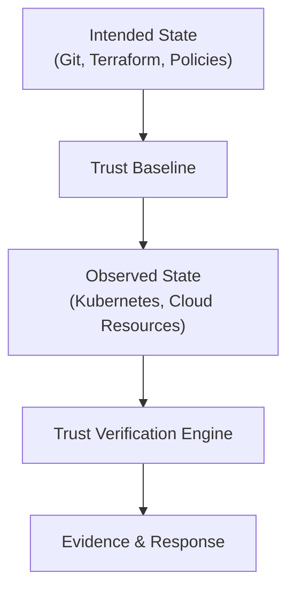
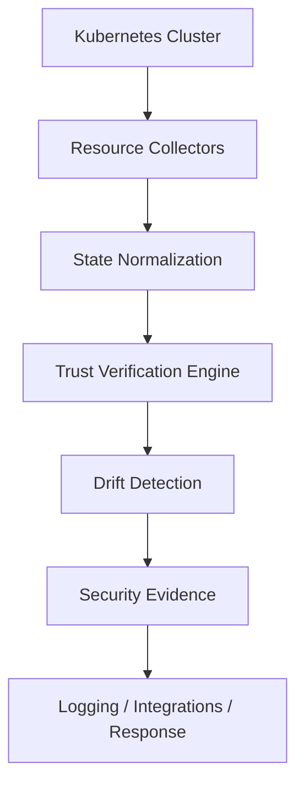

# AnchorState

> **AnchorState is an open-source runtime trust verification engine for Kubernetes and cloud-native infrastructure.**

Cloud-native environments are constantly changing.

Kubernetes controllers, GitOps pipelines, CI/CD systems, infrastructure automation, cloud APIs, and administrators continuously modify running systems.

While existing tools help teams deploy, scan, and manage infrastructure, a fundamental security question remains:

> **Does the running environment still match the secure state that was intended?**

AnchorState helps engineering teams detect runtime security drift, preserve evidence of unexpected changes, and maintain confidence in cloud-native environments.

**Status:** 🚧 Early Development (v0.1 Alpha)

---

# Problem

Modern cloud environments have multiple sources of truth:

- Git repositories
- Infrastructure-as-Code
- Kubernetes API state
- Cloud provider resources
- Runtime application configuration

Over time, these states can diverge.

Examples:

- A Kubernetes Secret is modified manually in production.
- A privileged user changes infrastructure outside approved workflows.
- A compromised account alters runtime resources.
- An automation system introduces unexpected configuration changes.

Traditional deployment systems can confirm that an application was deployed successfully, but they do not always continuously verify whether the running environment still matches the intended secure state.

AnchorState focuses on this gap.

---

# Why AnchorState Exists

Cloud infrastructure is dynamic by design.

Modern teams rely on:

- GitOps workflows
- Infrastructure-as-Code
- CI/CD pipelines
- Kubernetes operators
- Cloud provider APIs
- Automation platforms

These systems improve reliability, but they introduce a challenge:

A resource can change after deployment without immediately being identified as unexpected.

AnchorState asks:

> **Was this change expected, approved, and traceable?**

---

# Vision

Build an open-source platform that continuously verifies trust in cloud-native infrastructure by connecting:

AnchorState does not aim to replace existing security tools.

Instead, it focuses on the gap between:

**what engineers intended to run**

and

**what is actually running.**

---

# Trust Model

AnchorState defines trust as:

> A runtime environment is trusted when its observed state matches an approved security baseline.

Trust evaluation considers:

- Expected state
- Observed state
- Security policies
- Change context
- Evidence history

AnchorState is designed around the principle:

> Detect first. Understand second. Respond carefully.

---

# Current Focus

AnchorState v0.1 focuses on one specific problem:

## Kubernetes Runtime Security Drift Detection

The first capability:

> Detect unauthorized modifications to Kubernetes Secrets.

The objective is not to immediately build a massive security platform.

The objective is to build one security capability correctly, validate the engineering approach, and expand based on real security needs.

---

# v0.1 Alpha Capabilities

AnchorState Alpha will:

- Monitor Kubernetes Secrets
- Generate deterministic fingerprints
- Detect runtime modifications
- Identify unexpected state changes
- Produce structured security events
- Preserve security evidence
- Provide reproducible local demonstration environments
- Support security testing scenarios

---

# Non-Goals

AnchorState Alpha will **not**:

- Replace GitOps platforms
- Replace SIEM systems
- Replace vulnerability scanners
- Provide full CNAPP functionality
- Scan every cloud provider
- Provide compliance automation
- Automatically remediate production systems without explicit configuration

Keeping the initial scope narrow allows AnchorState to mature through reliable engineering rather than uncontrolled feature growth.

---

# Relationship With Existing Tools

AnchorState complements existing cloud security tooling.

GitOps platforms answer:

> "Is the deployed state synchronized with the desired state?"

AnchorState asks:

> "Has the runtime environment changed after deployment?"

Example:
Git:
database-secret = version 1
Production Runtime:
database-secret = version 2
GitOps Status:
Healthy
AnchorState:
Runtime drift detected

AnchorState is designed to provide an additional layer of runtime verification.

---

# Architecture

AnchorState follows a modular architecture.

Current architecture:

The architecture is designed to evolve into additional cloud-native trust verification capabilities while maintaining clear separation of responsibilities.

---

# Security Model

AnchorState assumes:

- Runtime environments can change after deployment.
- Not every change is malicious.
- Security decisions require context and evidence.
- Detection should operate independently from deployment workflows.

AnchorState does not assume:

- Git is always the only source of truth.
- Administrators are always trusted.
- Runtime state is always correct.

---

# Technology Stack

## Current

- Go
- Kubernetes
- Docker
- GitHub Actions

## Planned

- Terraform
- AWS
- Cloud provider APIs
- OpenTelemetry
- Prometheus metrics

The technology stack will evolve as the project matures.

---

# Development Roadmap

## Phase 1 — Foundation

- Repository architecture
- Development environment
- Documentation
- Engineering standards

## Phase 2 — Kubernetes Runtime Detection

- Kubernetes controller
- Secret monitoring
- Deterministic hashing
- Drift detection
- Security event generation

## Phase 3 — Security Engineering

- Attack simulations
- Automated testing
- Metrics
- CI/CD pipelines
- Security documentation

## Phase 4 — Platform Expansion

Future capabilities will be driven by:

- Real engineering needs
- User feedback
- Validated security problems

Potential areas of exploration:

- Additional Kubernetes resources
- Cloud provider integrations
- Infrastructure drift analysis
- Policy evaluation
- Security workflow integrations

---

# Engineering Principles

AnchorState follows these principles:

## Security First

Security tools must be designed with security as the foundation.

## Simplicity Over Complexity

A smaller reliable system is better than a large unreliable one.

## Modular Architecture

Components should evolve independently with clear responsibilities.

## Evidence-Driven Engineering

Security decisions should be explainable, traceable, and reproducible.

## Open Development

Design decisions, challenges, failures, and lessons learned are documented publicly.

---

# Repository Structure

The repository follows a separation-of-concerns approach.

Example:
cloudguard/
├── cmd/

├── internal/

├── api/

├── config/

├── deploy/

├── tests/

├── docs/

├── scripts/

└── README.md

The structure will evolve as functionality is implemented.

---

# Local Development

AnchorState is developed using:

- Linux environments
- Kubernetes local clusters
- Docker containers
- Infrastructure-as-Code workflows

Development documentation will be added as the first functional components are completed.

---

# Demo

Coming soon.

Planned demonstration:

1. Deploy a Kubernetes application
2. Establish a trusted security baseline
3. Modify a protected resource
4. Detect runtime drift
5. Generate a security event

---

# Testing

AnchorState will include:

- Unit tests
- Kubernetes integration tests
- Security attack simulations
- Reproducible local validation environments

---

# Security

Security issues should not be publicly disclosed.

If you discover a vulnerability in AnchorState, please follow the responsible disclosure process described in:
[SECURITY.md](https://github.com/abrarul-islam/CloudGuard/blob/main/SECURITY.md)

Please do not disclose vulnerabilities publicly before they have been reviewed.

---

# Contributing

AnchorState is currently in early development.

Bug reports, documentation improvements, discussions, and well-scoped pull requests are welcome.

Please read the project's [CONTRIBUTING](https://github.com/abrarul-islam/AnchorState/blob/main/CONTRIBUTING.md) before opening an issue or submitting a pull request.

---

# License

AnchorState is released under the MIT License.

See:
[LICENSE](https://github.com/abrarul-islam/AnchorState/blob/main/LICENSE)

for details.

---

# Building in Public

AnchorState is being developed openly.

The goal is not only to create software, but also to document the engineering process:

- Architecture decisions
- Implementation challenges
- Security research
- Technical lessons
- Failures and improvements

AnchorState is built on the belief that strong security engineering comes from continuous learning, transparency, and disciplined execution.
